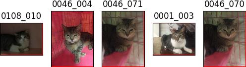

# Experiment 2023-05-11

## Methodology
- Train Inception-V3 on [Cat Individual Images](https://www.kaggle.com/datasets/timost1234/cat-individuals) (13536 images of 518 cats)
- Train with Cross Entropy loss, no crop of the cat from the image, train with 20 epoches and attain 79% accuracy.
- Create embeddings database from the last layer and query using KNN.

## Performance

    TOP 1 RETRIEVEL RATE
    There are 19 successes over 26 test cases
    Retrieval rate 73.08 %
    ------------------------------------------
    TOP 2 RETRIEVEL RATE
    There are 19 successes over 26 test cases
    Retrieval rate 73.08 %
    ------------------------------------------
    TOP 3 RETRIEVEL RATE
    There are 21 successes over 26 test cases
    Retrieval rate 80.77 %
    ------------------------------------------
    TOP 5 RETRIEVEL RATE
    There are 23 successes over 26 test cases
    Retrieval rate 88.46 %
    ------------------------------------------

## Visualization
|query 🔎|result 🗂|
|:--|:--|
|||
|||
|||
|||
|||
|||
|||
|||
|||
|||
|||
|||
|||
|||
|||
|||
|||
|||
|||
|||
|||
|||
|||
|||
|||
|||
