# Experiment 2023-05-20

## Methodology
- Same model as in exp **2023-05-11**
- However, there is a small change in extracting the embeddings. Instead of feeding the whole image as the input, now I cropped the cat out of the image using Grounding DINO, made sure it was a square crop, and then fed the network with the square crop to get the embeddings.
- All the steps after that are similar to exp **2023-05-11**
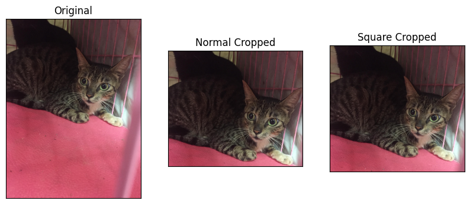
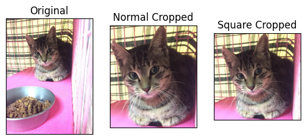

## Performance

    TOP 1 RETRIEVEL RATE
    There are 21 successes over 26 test cases
    Retrieval rate 80.77 %
    ------------------------------------------
    TOP 2 RETRIEVEL RATE
    There are 23 successes over 26 test cases
    Retrieval rate 88.46 %
    ------------------------------------------
    TOP 3 RETRIEVEL RATE
    There are 23 successes over 26 test cases
    Retrieval rate 88.46 %
    ------------------------------------------
    TOP 5 RETRIEVEL RATE
    There are 23 successes over 26 test cases
    Retrieval rate 88.46 %
    ------------------------------------------

## Visualization
|query 🔎|result 🗂|
|:--|:--|
|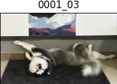|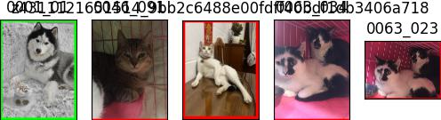|
|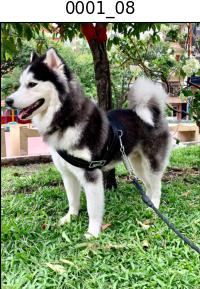|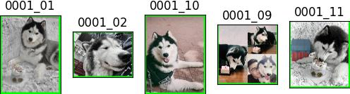|
|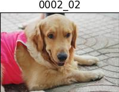|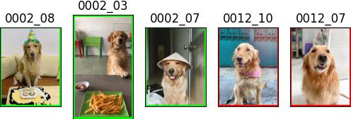|
|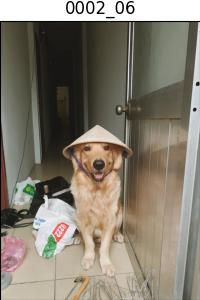|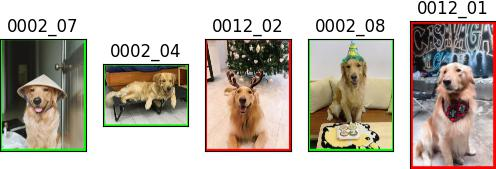|
||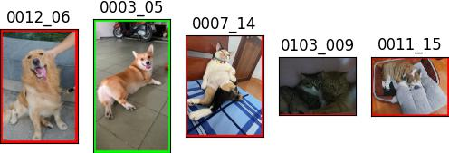|
|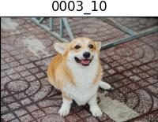|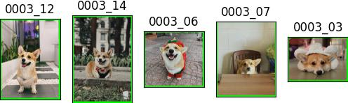|
|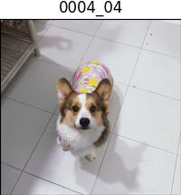|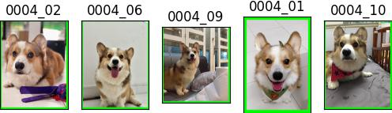|
|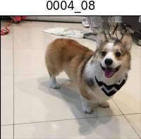|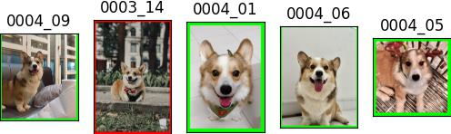|
|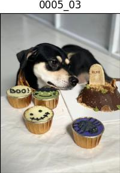|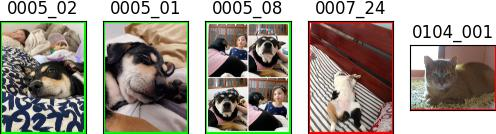|
|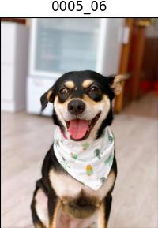|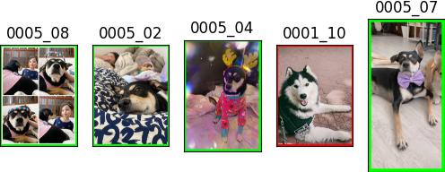|
|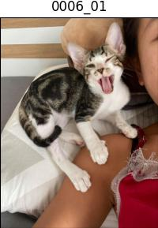|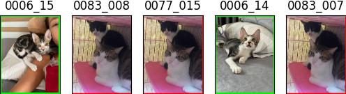|
|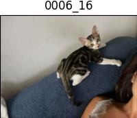|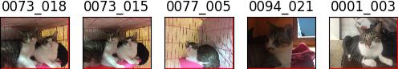|
|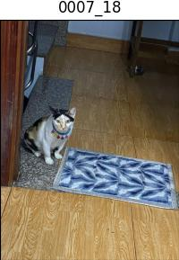|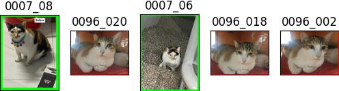|
|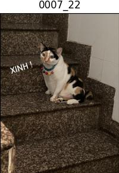|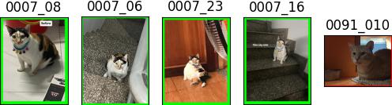|
|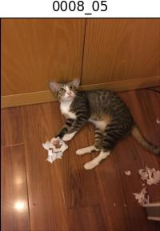|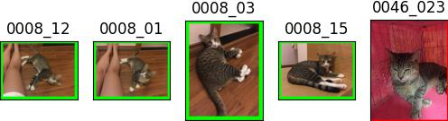|
|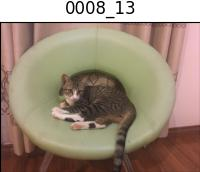|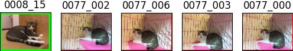|
|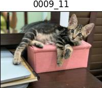||
|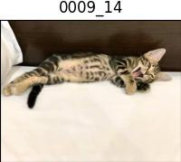|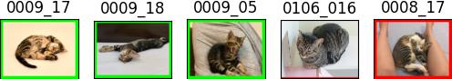|
|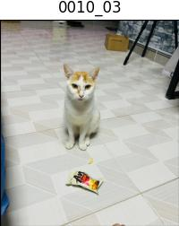|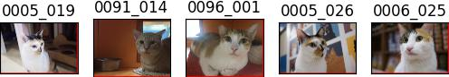|
|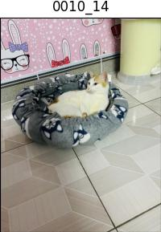|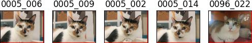|
|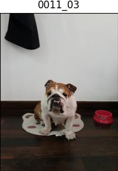||
|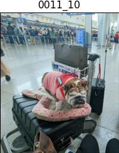|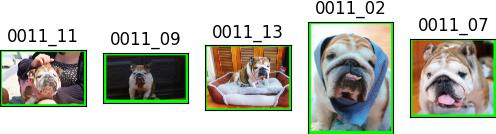|
|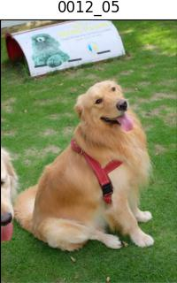|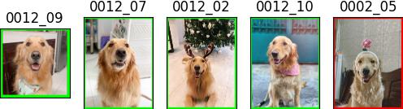|
||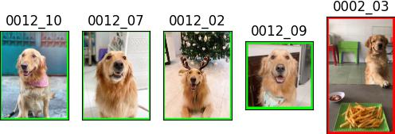|
|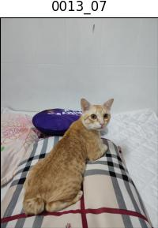|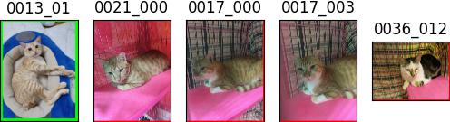|
|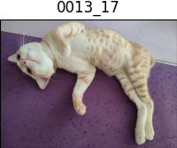|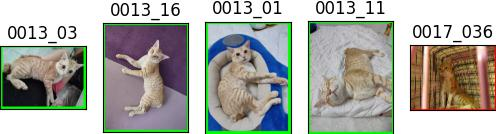|
